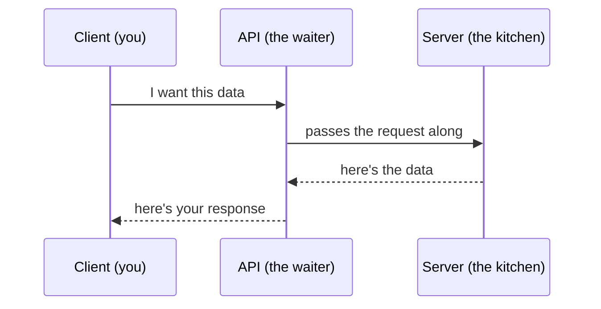
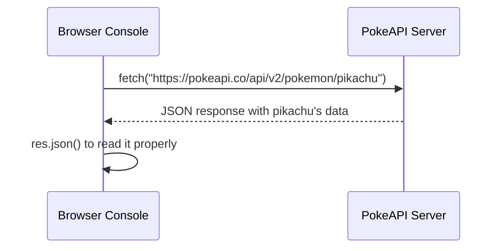

# JS APIs & Fetch 🧠

Day 10 — how the frontend actually talks to a server

This was a big one. Before today, "API" was just a word I heard a lot but didn't really understand. After today it finally makes sense — it's just how two computers talk to each other and ask for stuff.

---

## What an API actually is — the restaurant analogy

This analogy is the one thing that made everything else click, so writing it first.

Think of a restaurant:
- **you (the client)** — you don't walk into the kitchen and cook your own food
- **the waiter (the API)** — you tell the waiter what you want, the waiter carries your order to the kitchen, and later brings your food back
- **the kitchen (the server)** — this is where the actual food (data) gets made

So an API is just the middleman — it takes a request from the client, passes it to the server, and brings the response back. The client never talks to the server directly.



---

## Client and server — the basic rule

The **client always speaks first**. The server never randomly sends data on its own — it only responds when asked. And it's always one request → one response, not an ongoing conversation.

---

## What's actually inside a request and a response

A **request** (sent by the client) has 4 parts:
- **method** — what kind of action (GET, POST, etc.)
- **URL** — where the request is going
- **headers** — extra info about the request (like what type of data is being sent)
- **body** — the actual data being sent, if any

A **response** (sent back by the server) also has parts:
- **status** — a number that tells if it worked or failed
- **headers** — extra info about the response
- **body** — the actual data sent back

**Important habit:** always check the status code first, before looking at the body. The body of a response can say all kinds of things, but the status code is the one thing that tells the truth about what actually happened. A body can lie, a status code (mostly) doesn't.

---

## JSON — the data format used everywhere

APIs mostly send and receive data in a format called **JSON** (JavaScript Object Notation). It looks basically like a JS object, just written as text.

```js
// turning a response into usable JS data
const data = await response.json();

// turning JS data into text to send out
const body = JSON.stringify({ name: "Rahul", age: 16 });
```

`response.json()` is used to **read** incoming JSON data. `JSON.stringify()` is used to **prepare** data before sending it out, since it has to travel as plain text.

---

## The five HTTP methods

Every request has to pick one of these methods, depending on what needs to be done:

| method | means |
|---|---|
| `GET` | read / fetch data |
| `POST` | create something new |
| `PUT` | replace something completely |
| `PATCH` | update part of something |
| `DELETE` | remove something |

---

## GET vs POST

- **GET** — sends any extra info as part of the URL itself (like `?search=laptop`). Used just to read data.
- **POST** — sends data inside the body of the request, not the URL. Used to create something new.

**Why POST isn't safe to repeat:** every time a POST request runs, it usually creates something new again — so refreshing a page after a POST (like submitting a form twice) can end up creating duplicate data. GET is safe to repeat because it's just reading, not changing anything.

---

## Status codes — families to recognise

Status codes are grouped into families based on their first digit:

| range | meaning |
|---|---|
| `1xx` | information, request still processing |
| `2xx` | success — it worked |
| `3xx` | redirection — go look somewhere else |
| `4xx` | client error — something wrong with the request |
| `5xx` | server error — something broke on the server's side |

**The ones that come up all the time:**

| code | meaning |
|---|---|
| `200` | OK, request succeeded |
| `201` | created successfully |
| `204` | success, but no content to send back |
| `400` | bad request — something wrong with what was sent |
| `401` | unauthorized — not logged in / missing credentials |
| `403` | forbidden — logged in, but not allowed |
| `404` | not found |
| `429` | too many requests — rate limited |
| `500` | internal server error |

---

## REST URL design — URLs are nouns, methods are verbs

A well-designed API URL should describe a *thing*, not an *action*. The method (GET, POST, etc.) is what decides the action.

```
GET    /students        -> get all students
GET    /students/5       -> get student with id 5
POST   /students          -> create a new student
PUT    /students/5        -> replace student 5 completely
DELETE /students/5      -> delete student 5
```

Notice the URL never says "getStudents" or "deleteStudent" — it's always just `/students`. The verb comes from the HTTP method, not the URL.

---

## Using fetch() to actually make a request

The older way, using `.then()`:
```js
fetch("https://api.example.com/students")
  .then(res => res.json())
  .then(data => console.log(data));
```

The cleaner, more readable way, using `async/await`:
```js
async function getStudents() {
  const res = await fetch("https://api.example.com/students");
  const data = await res.json();
  console.log(data);
}
```

**Why `await` shows up twice:** the first `await` waits for the actual network request to finish and get a response back. The second `await` waits for `.json()` to finish turning that response into usable data — this step also takes a moment, so it needs its own await.

---

## Sending data with fetch (like a POST request)

```js
async function addStudent() {
  const res = await fetch("https://api.example.com/students", {
    method: "POST",
    headers: { "Content-Type": "application/json" },
    body: JSON.stringify({ name: "Rahul", marks: 92 })
  });
  const data = await res.json();
  console.log(data);
}
```

Here the method is set to `POST`, the header tells the server the data being sent is JSON, and the body carries the actual data — turned into text using `JSON.stringify`.

---

## Error handling — fetch doesn't always tell you when something fails

This was a genuinely surprising part: `fetch()` **only throws an error on an actual network failure** — like no internet connection at all. If the server responds with a 404 or a 500, `fetch()` still treats it as a "successful" request, because technically it did get a response back.

So `res.ok` has to be checked manually:

```js
async function getStudents() {
  const res = await fetch("https://api.example.com/students");
  if (!res.ok) {
    console.log("Something went wrong:", res.status);
    return;
  }
  const data = await res.json();
  console.log(data);
}
```

`res.ok` is `true` only for 2xx status codes — so this is the safety check that should basically always be there.

---

## Auth basics — API keys and Bearer tokens

Some APIs need proof of who's asking before they respond. Two common ways:
- **API key** — a unique string identifying the app/account making the request
- **Bearer token** — usually sent in the headers, proves the request is authenticated

```js
fetch("https://api.example.com/data", {
  headers: {
    Authorization: "Bearer YOUR_TOKEN_HERE"
  }
});
```

**Very important rule:** secret keys and tokens should never be written directly in frontend code, and never committed to git. They should live in a `.env` file instead, which stays out of version control (added to `.gitignore`). If a key ends up in frontend code or a public repo, literally anyone can copy and misuse it.

---

## The other side — a quick look at Express

Fetch is the client side. On the server side (using a tool like Express), the same kind of routes get written to actually respond to these requests:

```js
app.get("/students", (req, res) => {
  res.status(200).json(students);
});

app.post("/students", (req, res) => {
  // create a new student here
  res.status(201).json(newStudent);
});
```

`res.status().json()` is the server's way of doing exactly what was learned earlier — sending back a status code plus the actual JSON body.

---

## Live demo takeaway — PokeAPI

We tried this live in the browser console using the PokeAPI (a free public API for Pokémon data), just to see the whole request-response cycle happen in real time, and to see what an actual JSON response looks like when it comes back.



---

## Closing note

Before today, fetch felt like magic — now it's just a conversation, one request, one response, following rules that actually make sense. The part that'll stick the longest is checking `res.ok` myself, since fetch stays quiet even when something's actually broken.


