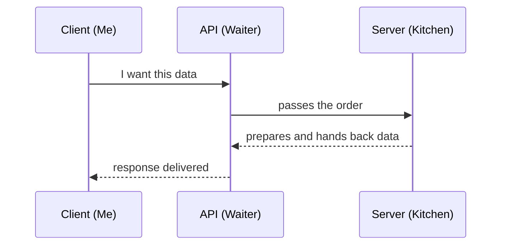
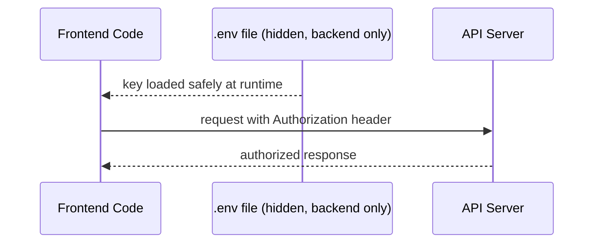

# Working with APIs & Fetch 🧠

How the frontend talks to a server, and gets data back

Fetch always felt like a black box before this session — now it's just a conversation between two computers, with rules that actually make sense.

---

## What an API is

The analogy that made everything click: a restaurant.

- **I'm the client** — sitting at the table, placing an order
- **the waiter is the API** — takes my order to the kitchen, brings the food back
- **the kitchen is the server** — actually makes the food

I never walk into the kitchen myself. I just tell the waiter what I want, and it handles the rest. That's exactly what an API does between my code and a server.



---

## Client and server

The **client always speaks first** — the server never sends anything on its own, it only responds when asked. And every exchange follows the same rule: **one request gives one response**, always.

---

## Anatomy of a request and a response

**A request has:**
- **method** — what kind of action is being asked for
- **URL** — where it's being sent
- **headers** — extra info about the request
- **body** — the actual data, if any

**A response has:**
- **status** — a number saying whether it worked
- **headers** — extra info about the response
- **body** — the actual data sent back

**habit worth building:** always check the **status code first**, before even looking at the body — the body can say something worked when it actually didn't, the status code is the more honest signal.

---

## JSON as the data format

Data mostly travels as **JSON** — objects and arrays written as plain text, so they can move over the internet.

```js
const data = await response.json();     // reads incoming data into a usable object
const payload = JSON.stringify(data);    // turns an object into text before sending
```

`response.json()` is for reading data coming in. `JSON.stringify()` is for preparing data going out.

---

## The five HTTP methods

| method | means |
|---|---|
| `GET` | read data |
| `POST` | create something new |
| `PUT` | replace something completely |
| `PATCH` | update part of something |
| `DELETE` | remove something |

---

## GET vs POST

GET sends extra info as part of the **URL** (like `?id=5`), no body involved. POST sends its data inside the **body**, hidden from the URL.

Also — **POST is not safe to repeat**. Refreshing after a GET is harmless, it just asks for the same data again. But refreshing right after a POST (like submitting a form) can accidentally trigger the same action twice, like placing the same order two times by mistake.

---

## Status code families

| range | meaning |
|---|---|
| `1xx` | informational, still processing |
| `2xx` | success |
| `3xx` | redirection |
| `4xx` | client error, something wrong with the request |
| `5xx` | server error, something broke server-side |

**the ones actually seen day to day:**

| code | meaning |
|---|---|
| `200` | OK |
| `201` | created |
| `204` | no content, worked but nothing to send back |
| `400` | bad request |
| `401` | unauthorized |
| `403` | forbidden |
| `404` | not found |
| `429` | too many requests |
| `500` | internal server error |

---

## REST URL design

**URLs are nouns, methods are verbs.** So instead of `/getAllProducts`, the URL is just `/products`, and the method decides what happens on it.

```
GET    /products       → read all products
POST   /products       → create a new product
GET    /products/5     → read product 5
PUT    /products/5     → replace product 5
DELETE /products/5     → delete product 5
```

---

## fetch() with .then() and async/await

The older way, chaining `.then()`:
```js
fetch("https://api.example.com/products")
  .then(res => res.json())
  .then(data => console.log(data));
```

The cleaner way, `async/await`:
```js
async function getProducts() {
  const res = await fetch("https://api.example.com/products");
  const data = await res.json();
  console.log(data);
}
```

**why await twice:** the first `await` waits for the response itself to arrive — status, headers. The second `await` waits for the body to actually be fully read and turned into usable JSON. Two separate things finishing at different moments, so two separate waits.

---

## Sending data with fetch

```js
async function createProduct(product) {
  const res = await fetch("https://api.example.com/products", {
    method: "POST",
    headers: { "Content-Type": "application/json" },
    body: JSON.stringify(product)
  });
  const data = await res.json();
  console.log(data);
}
```

Three pieces needed: the right `method`, a header telling the server it's JSON, and the data itself turned into text with `JSON.stringify()`.

---

## Error handling

`fetch()` does **not** throw an error on a 404 or a 500 — as far as fetch is concerned, it got *a* response, so it's satisfied, even if that response says something failed. It only throws on an actual network failure, like no internet at all.

So `res.ok` has to be checked manually:

```js
const res = await fetch("https://api.example.com/products");

if (!res.ok) {
  console.log("something went wrong:", res.status);
} else {
  const data = await res.json();
  console.log(data);
}
```

This is the part that would've been easy to skip without realising why it matters — silently trusting fetch to fail loudly when it actually just... doesn't.

---

## Auth basics: API keys and Bearer tokens

Two common ways an API checks who's asking:
- **API key** — a unique string identifying the app/account
- **Bearer token** — usually sent in a header, proves the request is logged in

```js
fetch("https://api.example.com/data", {
  headers: {
    Authorization: "Bearer " + token
  }
});
```

**the rule that matters most here:** secret keys live in a `.env` file, and never in frontend code, never in git. Frontend code is visible to anyone with DevTools open, so any key sitting there is basically public the moment it's shipped.



---

## The other side, with Express

While the frontend uses `fetch` to ask, something on the server side has to actually respond:

```js
app.get("/products", (req, res) => {
  res.status(200).json(products);
});

app.post("/products", (req, res) => {
  res.status(201).json(newProduct);
});
```

`app.get` and `app.post` define what happens when a request of that method hits that URL. `res.status().json()` sends back the status and the data together, in one line.

---

## Looking Back
Before today, fetch felt like magic — now it's just a conversation, one request, one response, following rules that actually make sense. The part that'll stick the longest is checking `res.ok` myself, since fetch stays quiet even when something's actually broken.

---

~**Tanushree**🪼
